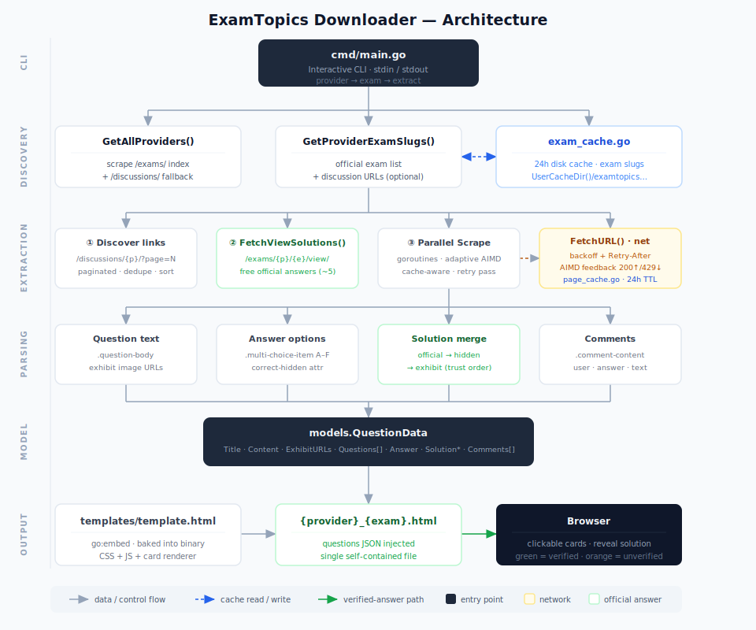

# ExamTopics Downloader (Enhanced Edition)

<p align="center">
  <a href="https://github.com/thatonecodes/examtopics-downloader">
    
  </a>
  <a href="https://go.dev/">
    
  </a>
  <a href="https://github.com/npapatheodorou/examtopics-downloader-but-prettier/releases/latest">
    
  </a>
</p>

> **This project is a fork of [thatonecodes/examtopics-downloader](https://github.com/thatonecodes/examtopics-downloader)**  
> Special thanks to [@thatonecodes](https://github.com/thatonecodes) for creating the original tool that made this possible.

---

## What is this?

**ExamTopics Downloader (Enhanced Edition)** is a user-friendly command-line tool that lets you download exam questions from [ExamTopics](https://examtopics.com/) and save them in a clean, readable format. Whether you're preparing for AWS, Azure, Google Cloud, CompTIA, or dozens of other certifications, this tool makes it easy to access and study exam questions offline.

---

## Features

| Feature | Description |
|---------|-------------|
| **Download Exams** | Fetch questions from any exam available on ExamTopics |
| **Clean HTML Output** | Beautiful, readable HTML format that's easy on the eyes |
| **Interactive Selection** | Browse and select exams with an easy-to-use menu |
| **Exam Simulation Mode** | Practice exams interactively with an HTML-based simulation |
| **Ready-to-Use .exe** | No need to install Go - download the pre-built executable and run it |
| **Cross-Platform** | Build from source for Windows, macOS, or Linux |

---

## Quick Start (Windows)

### Option 1: Use the Pre-built .exe (Recommended)

1. Go to the [Releases](https://github.com/npapatheodorou/examtopics-downloader-but-prettier/releases) page
2. Download the latest `examtopics-downloader-windows-amd64.exe`
3. Double-click to run - no installation needed!

### Option 2: Build from Source

If you have [Go installed](https://go.dev/dl/):

```bash
git clone https://github.com/npapatheodorou/examtopics-downloader-but-prettier.git
cd examtopics-downloader-but-prettier
go build -o examtopics-downloader.exe ./cmd/main.go
```

Or use the included build script:

```bash
build.bat
```

---

## How to Use

### Running the Tool

Simply double-click the `.exe` file (or run from terminal):

```
examtopics-downloader-windows-amd64.exe
```

### Step-by-Step

1. **Select a Provider**  
   Choose your certification vendor (e.g., AWS, Azure, CompTIA)

2. **Select an Exam**  
   Pick the specific exam or exam series you want to download

3. **Wait for Download**  
   The tool will fetch all questions and save them

4. **Open the Output**  
   Find the generated `.html` file in the same folder and open it in your browser

### Output Files

- **`provider_examname.html`** - The main exam output in HTML format
- Open the HTML file in any browser to view, print, or study

---

## Sample Workflow

```
============================================================
 ExamTopics Downloader - Interactive Exam Extractor
============================================================

[*] Loading providers from ExamTopics...
[OK] Done. Found 45 provider(s) in 4s.

--------------------------------------------------------
 Available Exams
--------------------------------------------------------
 Showing 1 of 1
 Filter: ""

   1. aws-saa-co03 (SAA-C03 - AWS Solutions Architect)

 Commands: [number] select | /text filter | / clear | /refresh refetch
Select> 1
[INFO] Starting extraction for aws / aws-saa-co03...
[OK] Successfully saved output: aws_saa-co03.html
```

---

## How It Works (Plain English)

This section is for people who just want to **understand what the tool does** without reading any code. If you're a developer, you can skip to *Technical Details*.

### Where the questions come from

ExamTopics has two kinds of pages for every exam:

1. **Discussion pages** — one page per question. These are open to everyone. They show the question, the answer options, and what other people said in the comments.
2. **The exam viewer** — a page at `examtopics.com/exams/<vendor>/<exam>/view/`. This is where the **real official answer** lives, hidden behind a *"Reveal Solution"* button. Only the first few questions are free; the rest need a paid account.

The tool reads **both** pages and combines what it finds.

### What you see in the output HTML

Every question becomes a **card** in the HTML file. A card has four parts:

1. **The question text and any pictures**  
   This comes from the discussion page.
2. **The answer area**  
   This is the part that's different depending on the question type (see below).
3. **The "Sneak Peek" button**  
   Click it to reveal the correct answer when you're done thinking.
4. **The "Comments" button**  
   Opens a list of what other students said in the discussion. Useful when the official answer is wrong or out-of-date.

### Three kinds of questions

ExamTopics uses three styles. The tool handles each one differently.

**1. Normal multiple-choice (most questions)**  
You see A, B, C, D options. Click one. The Sneak Peek shows which one is right.

> *Example:* "What is Azure? A) A cloud platform. B) A drink. C) A color. D) A car."

**2. HOTSPOT / Drag-and-drop (picture answers)**  
The question shows a picture (like a table or a diagram with dropdown menus). The correct answer is *another* picture showing the right selections filled in.

> *Example:* Question shows an empty table; the answer shows the table with the correct values picked.

If we found the **real** answer for this question, you see a green block titled **"Correct Answer"** with the solved picture and any explanation the site provides.

**3. Picture-only options (some questions)**  
The A/B/C/D choices are pictures, not words. The tool keeps them as clickable images.

### Where the "correct answer" actually comes from

The tool tries three sources, in order of how much we trust each one:

1. **The official "Reveal Solution"** (most trusted)  
   This is the real answer ExamTopics shows when you click *Reveal Solution* on the viewer page. The output marks this with a green **"Correct Answer"** label.
2. **A hidden marker on the discussion page**  
   For normal multi-choice questions, the discussion page tags the correct option with a hidden class. The tool reads that.
3. **Best guess from the question's own picture** (least trusted)  
   For HOTSPOT questions where #1 and #2 don't work, the tool shows the question's "Hot Area" picture as a guide and labels it **"Answer Area (unverified)"** in orange — meaning *"we couldn't get the official answer, so check the comments below to be sure."*

### Why some questions show "(unverified)"

ExamTopics gives the official answer for free only on the **first few questions** of each exam. After that, you need to log in to see them. The tool can only grab what's free. For the rest, it shows the question's own picture as a stand-in and labels it *unverified* so you know to double-check using the community comments.

### What happens behind the scenes

Step by step, when you run the tool:

1. **Pick the vendor** (Microsoft, AWS, etc.) from a menu.
2. **Pick the exam** (e.g. *ai-900*).
3. The tool finds the list of all question pages for that exam.
4. It fetches the **viewer page** once to grab the few free official answers.
5. It fetches **every discussion page** in parallel (with polite rate limiting so the site doesn't block us).
6. If a request gets rate-limited, the tool waits and tries again.
7. Each question is bundled into one card and written to the output HTML.
8. You open the HTML in any browser. Done.

A typical exam takes about **10–15 minutes** to fully download.

### What to do if something looks wrong

- **Picture missing?** Refresh the HTML or check your internet — pictures load from ExamTopics' servers.
- **Wrong answer?** Click **"Comments"** — the community usually catches it.
- **Question missing from your output?** Run again with the `-debug` flag to see which URLs failed.

---

## Improvements Over the Original

This fork includes several enhancements over the original [examtopics-downloader](https://github.com/thatonecodes/examtopics-downloader):

- **Fixed Missing Exams** - Added support for exams that were previously not accessible
- **Resolved Minor Issues** - Bug fixes and stability improvements
- **Better Usability** - Improved user experience for non-technical users
- **Compiled .exe Release** - No need to install Go; download and run
- **HTML Exam Simulation** - Practice exams in an interactive browser-based format
- **Enhanced Filtering** - Search and filter exams with the `/text` command

### Recent fixes (newbie-friendly summary)

- **No more silently lost questions.** The old version sometimes dropped about half the questions from image-heavy exams (e.g. *ai-900* used to give you 128 out of 246; it now gives you all 246). It no longer "gives up" quietly when a question is unusual — it includes it and tells you why if it can't read everything.
- **Picture-based answers are now visible.** HOTSPOT and drag-and-drop questions used to show a confusing *"no answers found"* message. They now show the picture as the answer area with a clear label.
- **Real official answers when available.** For the few questions ExamTopics opens up for free, the tool grabs the real *"Reveal Solution"* content — including the solved picture, the explanation paragraphs, and reference links — and shows it in a green **"Correct Answer"** block.
- **Honest labels.** When the official answer isn't available (paid-only questions), the tool says so explicitly: the picture is labelled **"Answer Area (unverified)"** in orange instead of pretending it's the verified answer.
- **Friendly when the website is busy.** The tool now retries when ExamTopics' servers say *"too many requests"* or have a hiccup, instead of losing the question.
- **Cleaner running output.** You get a one-line summary at the end (e.g. *"Extracted 246 of 246 question pages"*) so you can tell if anything is missing.

---

## Architecture



---

## Technical Details

### Requirements

- **Windows**: No additional requirements (pre-built .exe)
- **From Source**: Go 1.21+

### Building

```bash
# Build for Windows (amd64)
go build -o examtopics-downloader.exe ./cmd/main.go

# Build for other platforms
GOOS=linux GOARCH=amd64 go build -o examtopics-downloader ./cmd/main.go
GOOS=darwin GOARCH=amd64 go build -o examtopics-downloader ./cmd/main.go
```

### Output Formats

The tool generates clean, styled HTML that works in any browser. The HTML includes:
- Question text with proper formatting
- Multiple choice answers (A, B, C, D...)
- Correct answer highlights
- Explanation sections
- Clean, modern styling

---

## Disclaimer

This tool is for **educational purposes only**. ExamTopics content is copyrighted material. Please support ExamTopics by using their site directly if you can.

---

## License

See [LICENSE](LICENSE) for details.

---

## Credits

- **Original Author**: [@thatonecodes](https://github.com/thatonecodes) - Thank you for creating this amazing tool!
- **This Fork**: Enhanced and maintained by the community

---

<p align="center">
  <strong>Good luck with your certification studies!</strong>
</p>
